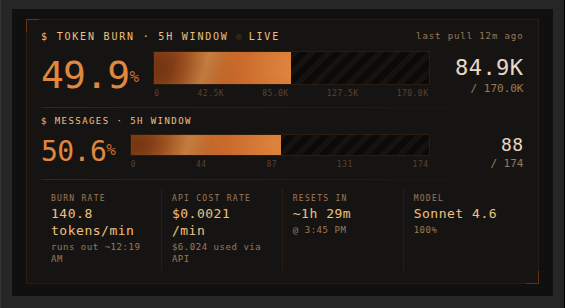

# KOS Burn Bar

An Obsidian plugin that displays a live token burn meter for Claude Code sessions. Part of the [KOS](https://github.com/k0d3x8its/kos) toolkit.

---

## What It Does

Claude Code enforces a rolling 5-hour token limit on your account. Once you hit it, Claude Code stops responding until the window resets. The KOS Burn Bar reads Claude Code's local session logs and shows you exactly where you stand — before you run out.

It displays:
- How many tokens you've burned in the current 5-hour window
- How many messages you've used
- Your current burn rate (tokens/min)
- The API-equivalent cost of your session
- When your window resets
- Which Claude model(s) you're using and their token share

---

## Installation

No build step required.

1. Download `main.js`, `manifest.json`, and `styles.css`
2. Create folder: `<your-vault>/.obsidian/plugins/kos-burn-bar/`
3. Drop all three files into that folder
4. Open Obsidian → Settings → Community Plugins → enable **KOS Burn Bar**

The burn bar opens automatically on vault load in the right sidebar. You can also open it from the flame icon in the ribbon or via the command palette (`Open KOS Burn Bar`).

---

## The Display

### Token Burn Bar
Shows tokens used vs your detected (or manually set) 5-hour limit. Percentage can exceed 100% — this means you are over limit and Claude Code may rate-limit you.

### Messages Bar
Tracks the number of user messages sent in the current window. The message limit scales proportionally with your token limit.

### Stats Row

| Stat | What it shows |
|------|---------------|
| **BURN RATE** | Total tokens (input + output) per minute, averaged over the last 60 minutes. Includes estimated exhaustion time. |
| **API COST RATE** | Tokens priced at Anthropic API rates ($/min). Shows total session API-equivalent cost. **Pro plan users: this is not your actual charge** — you pay a flat subscription. |
| **RESETS IN** | Live countdown to when your 5-hour window expires and limits reset. |
| **MODEL** | Which Claude model(s) generated tokens this session and their percentage share. |

---

## How It Works

Claude Code writes a `.jsonl` log file for each session under `~/.claude/projects/`. Each line is a JSON record with token counts, model, and timestamp.

The plugin:
1. Walks all project directories under `~/.claude/projects/`
2. Re-parses only files that have changed since last read (file cache by mtime)
3. Deduplicates records by UUID
4. Groups records into 5-hour session blocks — a new block starts when messages resume after a 1-hour gap
5. Identifies the active block (endTime > now, last message < 5h ago)
6. Computes all stats from that block

Between full refreshes, the bar advances smoothly every second using the current burn rate as an extrapolation.

### Token Limit Detection

If no manual limit is set, the plugin auto-detects your limit using p90 of completed session block totals from the past 8 days. This prevents the current session from setting its own limit (circular: limit = current usage = 100% always).

Set a manual limit in settings if you know your plan's ceiling.

### Cost Calculation

Uses Anthropic's published API pricing with full tiered breakdown:

| Token type | Sonnet | Opus | Haiku 3.5 |
|------------|--------|------|-----------|
| Input (uncached) | $3.00/1M | $15.00/1M | $0.80/1M |
| Cache write | $3.75/1M | $18.75/1M | $1.00/1M |
| Cache read | $0.30/1M | $1.50/1M | $0.08/1M |
| Output | $15.00/1M | $75.00/1M | $4.00/1M |

Cache read dominates long sessions because every turn replays the full conversation from cache.

---

## Settings

| Setting | Default | Description |
|---------|---------|-------------|
| **Token limit (manual override)** | 0 (auto) | Set to your known 5h token ceiling. 0 = auto-detect from session history. Pro plan users: calibrate by dividing current token count by claude.ai's displayed percentage. |
| **Fallback limit** | 44,000 | Used when auto-detection has no history yet. |
| **Refresh interval (seconds)** | 5 | How often to re-read session logs. Lower = more accurate percentage. At 5s and 2400 tokens/min, max staleness is ~0.07% on a 300K limit. File cache keeps CPU impact minimal. Enter a value between 5 and 300. |
| **Timezone** | America/New_York | IANA timezone for reset time display. |
| **Project filter** | (blank) | Restrict tracking to one Claude Code project. Enter any part of your working directory name (e.g. `ace-vault`). Leave blank to track all projects — recommended, since Claude Code rate limits are account-wide. |
| **Auto-open on vault start** | on | Opens the burn bar panel automatically when Obsidian loads. |

### Calibrating the Token Limit

If you're on a Claude Pro subscription and want the percentage to match claude.ai's display:

1. Note your current token count shown in the burn bar (e.g. `310K`)
2. Note the percentage claude.ai shows for the same moment (e.g. `74%`)
3. Calculate: `310,000 ÷ 0.74 ≈ 418,919`
4. Enter `418000` (round down) in **Token limit (manual override)**

Re-calibrate if you change Claude plans.

---

## Cross-Project Aggregation

This project was inspired by [CLaude Code Monitor](https://github.com/Maciek-roboblog/Claude-Code-Usage-Monitor). By default the burn bar aggregates all Claude Code projects into one 5-hour window. This is intentional — Claude Code's rate limits are account-wide, not per-project. If you run multiple Claude Code sessions simultaneously, all token usage counts against the same limit.

Tools like Claude Code Monitor (CCM) track only the current session, so their numbers will be lower. Neither is wrong — they answer different questions:

- **KOS Burn Bar (all projects):** how close am I to my account rate limit?
- **CCM (current session):** how much did this specific session use?

Use the **Project filter** setting to scope to one project if you prefer per-session tracking.

---

## Notes

- **Desktop only** — requires filesystem access to `~/.claude/projects/`
- **Pro plan users** — the API COST RATE and "used via API" figures show what your usage would cost at pay-per-token API rates. Your actual charge is your flat subscription fee.
- The burn bar is a read-only observer — it never writes to or modifies Claude Code's session files.

---

## Part of KOS Toolkit

KOS Burn Bar is a companion tool for the [KOS Toolkit](https://github.com/k0d3x8its/kos). KOS transforms an Obsidian vault into an LLM-maintained knowledge base using Claude Code as the librarian. The burn bar lets you monitor your Claude Code usage while running KOS operations — so a long `/kos-ingest` session doesn't catch you off guard at the rate limit wall.
